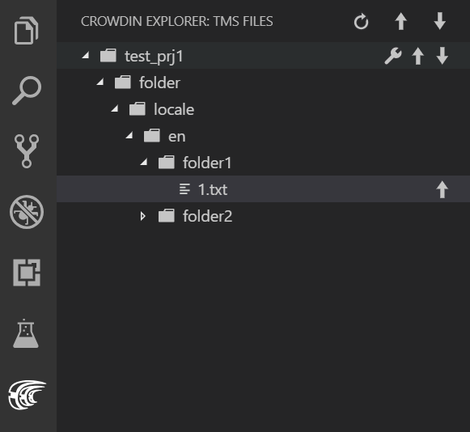

<p align="center">
  <picture>
    <source media="(prefers-color-scheme: dark)" srcset="https://support.crowdin.com/assets/logos/symbol/png/crowdin-symbol-cWhite.png">
    <source media="(prefers-color-scheme: light)" srcset="https://support.crowdin.com/assets/logos/symbol/png/crowdin-symbol-cDark.png">
    
  </picture>
</p>

# Crowdin Visual Studio Code Plugin [](https://twitter.com/intent/tweet?url=https%3A%2F%2Fgithub.com%2Fcrowdin%2Fvscode-crowdin&text=Manage%20and%20synchronize%20your%20localization%20resources%20with%20Crowdin%20project%20instantly%20from%20Visual%20Studio%20Code)&nbsp;[](https://github.com/crowdin/vscode-crowdin/stargazers)

Integrate your Visual Studio Code projects with Crowdin to optimize the localization process. The plugin allows uploading new source strings instantly to your Crowdin project, updating them back from Crowdin and downloading translations.

<div align="center">

[Get it from the VS Code Marketplace →](https://marketplace.visualstudio.com/items?itemName=Crowdin.vscode-crowdin)

[](https://marketplace.visualstudio.com/items?itemName=Crowdin.vscode-crowdin)
[](https://marketplace.visualstudio.com/items?itemName=Crowdin.vscode-crowdin)
[](https://marketplace.visualstudio.com/items?itemName=Crowdin.vscode-crowdin&ssr=false#review-details)
[](https://marketplace.visualstudio.com/items?itemName=Crowdin.vscode-crowdin)

 </div>

## Features

A new component will be introduced in the Activity Bar called the *Crowdin Explorer*.
The plugin will scan each workspace for a Crowdin-specific configuration file and will build a tree with source files.

### Sources and translations sync, tracking project progress

With this plugin you can:
- Upload files for translation to Crowdin.
- Download sources and translations from Crowdin.
- Track progress of translated and approved strings for each project and target language.

[<p align="center"></p>](https://support.crowdin.com/visual-studio-code-plugin/)

### String keys autocompletion

Use string keys in your code fetched from Crowdin and available in autocomplete suggestions. Whenever a user types something, the VSCode autocompletion will suggest available string keys from Crowdin.

There is a possibility to configure file extensions, where the string keys autocompletion will appear. By default, autocompletion is turned on and available in all files.

Strings for autocompletion are loaded during the bootstrap of VSCode and are also updated whenever there was a change in the `crowdin.yml` configuration file.

[<p align="center"></p>](https://github.com/crowdin/vscode-crowdin/releases/tag/1.4.0/)

This gif illustrates the autocompletion of string keys in a React project that uses the [LinguiJS](https://lingui.js.org/tools/crowdin.html) library.

## Configuration

To work with the plugin in the Visual Studio Code workspace, there should be a Crowdin configuration file called either `crowdin.yml` or `crowdin.yaml`.

Configuration file example:

```yaml
"project_id": "projectId"
"api_token": "apiToken"
"base_path": "folder" // optional
"branch": "master" // optional
"base_url": "https://{organization-name}.crowdin.com" // optional (for Crowdin Enterprise only)

"files": [
  {
    "source": "/sources/**/*.xml",
    "translation": "/translations/%two_letters_code%/%original_file_name%",
    "update_option": "update_as_unapproved", // optional
    "excluded_target_languages": ["uk", "fr"], // optional
    "labels": ["android", "emails"], // optional
    "dest": "/app/%file_name%.xml", // optional
    "type": "android" // optional
  },
  {
    "source": "multicolumn.csv",
    "translation": "multicolumn.csv",
    "scheme": "identifier,source_phrase,context,uk,ru,fr" // optional
  }
]
```

You also can use environment variables in the configuration file [Environment variables](https://support.crowdin.com/configuration-file/#api-credentials-from-environment-variables):

```yaml
"project_id_env": "CROWDIN_PROJECT_ID"
"api_token_env": "CROWDIN_PERSONAL_TOKEN"
"base_path_env": "CROWDIN_BASE_PATH" // optional
"branch": "master" // optional
"base_url_env": "CROWDIN_BASE_URL" // optional (for Crowdin Enterprise only)

"files": [
  {
    "source": "/sources/**/*.xml",
    "translation": "/translations/%two_letters_code%/%original_file_name%",
    "update_option": "update_as_unapproved", // optional
    "excluded_target_languages": ["uk", "fr"], // optional
    "labels": ["android", "emails"], // optional
    "dest": "/app/%file_name%.xml", // optional
    "type": "android" // optional
  }
]
```

The project ID can be found in Tools > API on your Crowdin project page.

To generate a new API token in Crowdin, go to your Account Settings.

## Setup

1. Prepare a `crowdin.yml` or `crowdin.yaml` configuration file and add it to the needed workspace in Visual Studio Code.
2. Install the *Crowdin* plugin using one of the following methods:
    * open VS Code Extensions (**Ctrl+Shift+X**), search for *Crowdin* and click **Install**

      or

    * launch VS Code Quick Open (**Ctrl+P**), paste the below command, and press **Enter**
        ```
        ext install Crowdin.vscode-crowdin
        ```

3. The *Crowdin* plugin scans each Visual Studio Code workspace to find a Crowdin configuration file (*crowdin.yml* or *crowdin.yaml*). It automatically builds the tree with source files in the *Crowdin Explorer* component available in your Activity Bar.
4. Use upward and downward arrows in the *Crowdin Explorer* component to upload source files to Crowdin and download translations correspondingly.

## Extension Settings

This extension contributes the following settings:

* `tms.autoRefresh`: enable/disable auto refresh of the file tree after each change in the Crowdin configuration file

* `tms.stringsCompletion`: enable/disable autocompletion of strings keys

* `tms.stringsCompletionFileExtensions`: Comma-separated list of file extensions for which autocomplete should be active. By default, strings autocomplete will be active in all files

* `tms.useGitBranch`: enable/disable the use of a Git branch as a Crowdin branch.

## Known Issues

At the moment, the plugin does not support all possible properties in the configuration file (see [Configuration file](https://support.crowdin.com/configuration-file-v3/)). All properties which are supported by this plugin are listed in the example above.

## Seeking Assistance

If you find any problems or would like to suggest a feature, please read the [How can I contribute](/CONTRIBUTING.md#how-can-i-contribute) section in our contributing guidelines.

Need help working with Crowdin Visual Studio Code Plugin or have any questions? [Contact](https://crowdin.com/contacts) Customer Success Service.

## Contributing

We are happy to accept contributions to the Crowdin Visual Studio Code Plugin. If you want to contribute, please read the [Contributing](/CONTRIBUTING.md) guidelines.

## License
<pre>
The Crowdin Visual Studio Code Plugin is licensed under the MIT License.
See the LICENSE file distributed with this work for additional
information regarding copyright ownership.

Except as contained in the LICENSE file, the name(s) of the above copyright
holders shall not be used in advertising or otherwise to promote the sale,
use or other dealings in this Software without prior written authorization.
</pre>
